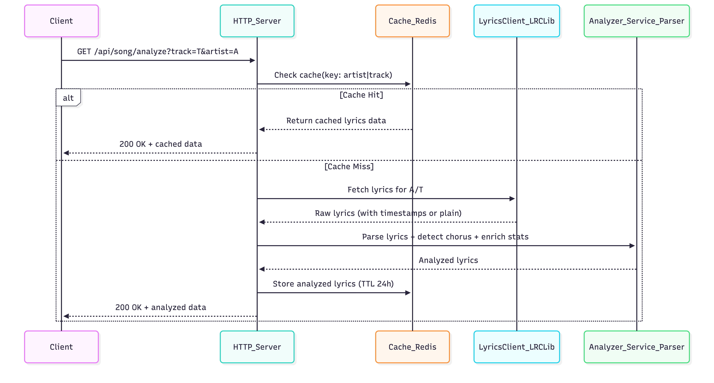

# Lyrics Analyzer Service

Production-ready Go service that fetches, parses, and enriches song lyrics with timestamps and structure detection.

## Features

- **Lyrics Fetching:** LRCLib API integration with retry logic and exponential backoff
- **Parsing:** Synced (timestamped) and plain lyrics support
- **Structure Detection:** Automatic chorus detection using repetition analysis
- **Caching:** Redis-backed caching with 24-hour TTL
- **Production-Ready:** Docker support, health checks, graceful shutdown, structured errors
- **Extensible Architecture:** Easy to add new providers (metadata, AI classification, additional lyrics sources)

## Tech Stack

- **Language:** Go 1.24
- **Cache:** Redis 7 with LFU eviction
- **Deployment:** Docker multi-stage builds
- **Testing:** Table-driven tests with 29 test cases

## Sequence Diagram



## Architecture

```
lyrics-analyzer/
├── cmd/main.go              # Application entry point
├── internal/
│   ├── server/              # HTTP server setup
│   ├── handler/             # HTTP request handlers
│   ├── service/             # Business logic layer
│   │   ├── service.go       # Main orchestration
│   │   ├── caching_provider.go     # Cache decorator
│   │   ├── chorus_detector.go      # Chorus detection
│   │   └── parser_*.go             # Lyrics parsers (synced/plain/timestamp)
│   ├── client/              # HTTP client with retry logic
│   │   └── lrclib/          # LRCLib API implementation
│   ├── cache/               # Caching abstraction
│   │   ├── redis/           # Redis implementation
│   │   └── noop.go          # No-op cache for testing
│   ├── model/               # Domain models
│   └── config/              # Configuration management
└── docker/                  # Docker deployment files
```

### Error Handling

The project uses **type-safe error handling** with Go's `errors.Is()` pattern for robust error propagation:

**Error Flow:**
```
Client (lrclib) → Service (wrapping) → Handler (HTTP mapping)
```

**Error Mapping:**

| Client Error | Service Wraps | Handler Maps | HTTP Status |
|--------------|---------------|--------------|-------------|
| `ErrLyricsNotFound` | `model.ErrNotFound` | `errors.Is()` check | 404 Not Found |
| `ErrRateLimited` | `model.ErrRateLimited` | `errors.Is()` check | 429 Too Many Requests |
| `context.DeadlineExceeded` | Pass through | `errors.Is()` check | 504 Gateway Timeout |
| `APIError{500/503}` | Generic wrap | Default case | 500 Internal Server Error |

**Benefits:**
- ✅ Type-safe (compile-time checked)
- ✅ Refactor-safe (no string matching)
- ✅ Works with error wrapping (`%w`)
- ✅ Follows Go best practices

### 🏗️ Design Pattern Impact

The architecture utilizes the following patterns to separate safety, infrastructure, and business logic:

| Pattern | Component/Location | Impact & Purpose |
| --- | --- | --- |
| **Decorator** | `RetryDecorator`, `CachingProvider` | Wraps the base client to add **resiliency** (retries) and **performance** (caching) without modifying the original API request logic. |
| **Factory** | `internal/cache/factory.go` | Provides a unified way to initialize different cache providers (Redis vs. Noop) based on environment variables. |
| **Adapter** | `internal/client/lrclib/search.go` | Decouples the service from external changes by converting [LRCLib API](https://www.google.com/search?q=http://localhost:8080/api/song/analyze%3Ftrack%3DImagine%26artist%3DJohn%2520Lennon) responses into a standardized internal model. |
| **Dependency Injection** | `main.go` / Constructors | Increases **testability** by injecting providers and parsers into the service at startup, allowing for easy mocking. |


## Quick Start

### 1. Setup Environment (Optional)

```bash
# Copy example config (optional - has sensible defaults)
cp .env.example .env

# Edit .env if needed (e.g., change REDIS_PASSWORD for local dev)
```

### 2. Start Redis

```bash
docker-compose -f docker/docker-compose.dev.yml up -d
```

### 3. Start the Server

```bash
# With Redis cache (default)
go run ./cmd/main.go

# Or with caching disabled
CACHE_TYPE=none go run ./cmd/main.go
```

Server starts on `http://localhost:8080`

### 4. Test Health Endpoint

```bash
curl http://localhost:8080/health
```

**Response:**
```json
{
  "status": "ok",
  "timestamp": "2026-01-10T17:29:51.384Z",
  "version": "1.0.0"
}
```

### 5. Analyze a Song

```bash
curl "http://localhost:8080/api/song/analyze?track=Imagine&artist=John%20Lennon"
```

## API Endpoints

- `GET /health` - Health check endpoint
- `GET /api/song/analyze?track=SONG&artist=ARTIST` - Analyze song lyrics

📖 **For detailed API testing examples, see [TESTING.md](TESTING.md)**

## Configuration

Configure via environment variables (see [.env.example](.env.example)):

```bash
# Server
SERVER_ADDR=:8080

# LRCLib API
LRCLIB_BASE_URL=https://lrclib.net
LRCLIB_TIMEOUT=10s

# Retry/Backoff
RETRY_MAX_RETRIES=3
RETRY_BACKOFF=100ms
RETRY_MAX_BACKOFF=5s
RETRY_MULTIPLIER=2.0

# Cache
CACHE_TYPE=redis          # "redis" or "none"
CACHE_TTL=24h

# Redis
REDIS_ADDR=localhost:6379
REDIS_PASSWORD=
REDIS_DB=0
```

## Caching

The service uses Redis for caching to improve performance:

- **Cache Keys:** SHA-256 hash of normalized `artist|track` (case-insensitive)
- **TTL:** 24 hours (configurable)
- **Graceful Degradation:** Cache failures don't break requests
- **Async Writes:** Non-blocking cache writes
- **Cache Hit Tracking:** Response includes `"cached": true/false`

## 🛡️ Concurrency & Thread Safety

The `lyrics-analyzer` is designed to be **stateless** and **thread-safe**, making it suitable for high-concurrency environments like Kubernetes or Docker Swarm. Below is a breakdown of how the system handles concurrent operations:

### Concurrency Breakdown

| Scenario | Safe? | Implementation Detail |
| :--- | :--- | :--- |
| **Multiple Reads** | ✅ Yes | Redis `GET` operations are inherently atomic. Multiple goroutines can safely fetch the same lyrics simultaneously. |
| **Multiple Writes** | ✅ Yes | We follow a "last-write-wins" strategy. Since lyrics data for a specific track is idempotent, concurrent writes do not lead to corrupted states. |
| **Read/Write Races** | ✅ Yes | The [Cache-aside pattern](https://github.com/mgomez-halley-code/lyrics-analyzer/blob/main/internal/service/caching_provider.go) used in the service naturally tolerates minor race conditions by falling back to the API. |
| **Counter Increments** | ❌ No | Standard `GET/SET` flows would require Redis `INCR` or distributed locks. (Not currently used in this service). |
| **Distributed Transactions** | ❌ No | Cross-key consistency is not guaranteed without `MULTI/EXEC` or distributed locking mechanisms. |


### Verify Caching Performance

```bash
# First request - cache MISS (~8000ms)
time curl "http://localhost:8080/api/song/analyze?track=Imagine&artist=John%20Lennon"

# Second request - cache HIT (~1ms)
time curl "http://localhost:8080/api/song/analyze?track=Imagine&artist=John%20Lennon"
```

### Inspect Redis Cache

```bash
# List all cached lyrics
docker-compose -f docker/docker-compose.dev.yml exec redis redis-cli KEYS "lyrics:*"

# Get specific entry
docker-compose -f docker/docker-compose.dev.yml exec redis redis-cli GET "lyrics:<key>"

# Clear cache
docker-compose -f docker/docker-compose.dev.yml exec redis redis-cli FLUSHDB
```

## Testing

```bash
# Run all tests (29 tests)
go test ./... -v

# Run specific package tests
go test ./internal/client -v

# Run with coverage
go test ./... -v -cover
```

## Docker Deployment

### Development (Redis Only)

```bash
docker-compose -f docker/docker-compose.dev.yml up -d
```

### Production (Full Stack)

**Prerequisites:** Create a `.env` file with `REDIS_PASSWORD` (required for security).

```bash
# 1. Set Redis password (REQUIRED)
echo "REDIS_PASSWORD=$(openssl rand -base64 32)" > .env

# 2. Build and start API + Redis
docker-compose -f docker/docker-compose.prod.yml --env-file .env up -d --build

# 3. Verify health
curl http://localhost:8080/health
```

**Note:** The `.env` file is gitignored for security. Never commit passwords to version control.

#### Inspect Redis Cache

```bash
export $(grep -v '^#' .env | xargs)

docker-compose -f docker/docker-compose.dev.yml exec redis redis-cli -a $REDIS_PASSWORD KEYS "lyrics:*"
docker-compose -f docker/docker-compose.dev.yml exec redis redis-cli -a $REDIS_PASSWORD GET "lyrics:<key>"
docker-compose -f docker/docker-compose.dev.yml exec redis redis-cli -a $REDIS_PASSWORD FLUSHDB
```

🐳 **For complete deployment instructions, cache testing, and security verification, see [docker/README.md](docker/README.md)**

## Security & Production Considerations

This is a development/demonstration project. For production deployment:

### Recommended Improvements
- ✅ Graceful shutdown (implemented)
- ✅ Health endpoints (implemented)
- ⏳ Structured logging and tracing (OpenTelemetry)
- ⏳ Metrics and dashboards (Prometheus/Grafana)
- ⏳ Rate limiting (per-IP, Redis-backed)
- ⏳ Authentication middleware

## CI/CD

GitHub Actions workflow runs on push/PR:
- Static analysis (`go vet`)
- Unit tests (29 tests)
- Build verification

See [.github/workflows/ci.yml](.github/workflows/ci.yml)

## Future Enhancements

The project's extensible architecture makes it easy to add new capabilities:

### Metadata Enrichment
Add a **MusicBrainz API client** to enrich song metadata with:
- Release dates, countries, record labels
- Artist information and genres
- Album artwork and additional details

### AI-Powered Classification
Integrate **LLM APIs** (Claude, OpenAI, etc.) to classify songs by:
- Genre and subgenres
- Mood and themes
- Language and era
- Content analysis

### Advanced Analytics
- Lyrics statistics (word count, uniqueness, repetition ratio)
- Sentiment analysis

All enhancements follow the existing provider pattern - simply implement the appropriate interface and register with the service layer.

## License

This project is provided as-is for development and demonstration purposes.
